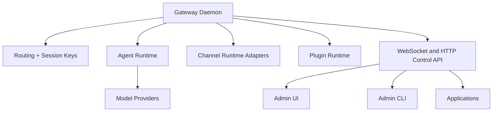

# OpenClaw Architecture Overview (Validated)

Generated on: 2026-02-12
Based on:
- `/Users/gregho/GitHub/AI/ForgeMate/studys/openclaw-codebase-deep-study.md`
- `/Users/gregho/GitHub/AI/ForgeMate/studys/openclaw-fork-design-reference.md`

## 1. Corrected Architecture List

Your original understanding is mostly correct after terminology alignment:

- Gateway daemon (single control plane owner)
- Channel runtime/adapters (Telegram, WhatsApp, Discord, Slack, etc.)
- Agent runtime
- Model providers
  - Anthropic
  - OpenAI
  - Google
- WebSocket/HTTP control interface
  - Admin UI
  - Admin CLI (partially local route-first, partially gateway-mediated)
  - Applications (web/native)

Important correction:
- Channels are not primarily Gateway WebSocket clients.
- Channel integrations mainly run as channel adapters through each platform SDK/API/webhook pipeline.

## 2. High-Level Diagram

## 3. Boundary Notes

- Gateway is the runtime owner for config, auth, routing, approvals, and lifecycle.
- Agent runtime encapsulates model selection, fallback, and provider dispatch.
- Channel runtime encapsulates inbound normalization and outbound delivery for each platform.
- Plugin runtime extends channels, providers, methods, and tools without changing core runtime.
