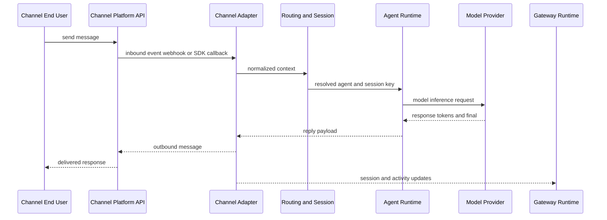
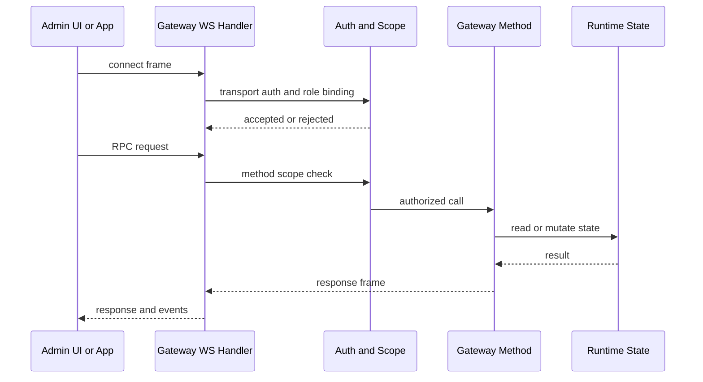

# OpenClaw Complete Architecture Diagram

Generated on: 2026-02-12
Based on:
- `/Users/gregho/GitHub/AI/ForgeMate/studys/openclaw-codebase-deep-study.md`
- `/Users/gregho/GitHub/AI/ForgeMate/studys/openclaw-fork-design-reference.md`

## 1. Full Layered Architecture

```mermaid
flowchart LR
  subgraph Clients[Clients and Operators]
    U1[Admin UI]
    U2[Admin CLI]
    U3[Web and Native Apps]
  end

  subgraph Entry[Entry and CLI]
    E1[entry.ts]
    E2[run-main.ts]
    E3[route-first commands]
  end

  subgraph Config[Config Pipeline]
    C1[JSON5 load]
    C2[includes resolution]
    C3[config.env injection]
    C4[env substitution]
    C5[schema validation]
    C6[defaults and normalization]
    C7[snapshot and cache]
  end

  subgraph Gateway[Gateway Control Plane]
    G1[gateway runtime lifecycle]
    G2[auth and role and scope checks]
    G3[ws protocol and handshake]
    G4[gateway methods dispatch]
    G5[reload and shutdown hooks]
  end

  subgraph Core[Core Runtime]
    R1[routing resolver]
    R2[session key builder]
    A1[auto-reply dispatcher]
    A2[agent runtime]
    A3[model selection and fallback]
    A4[provider adapters]
  end

  subgraph Providers[External Model Providers]
    P1[Anthropic]
    P2[OpenAI]
    P3[Google]
    P4[Other providers]
  end

  subgraph Channels[Channel Runtime]
    CH1[Telegram adapter]
    CH2[WhatsApp adapter]
    CH3[Discord and Slack adapters]
    CH4[other channels]
  end

  subgraph Platform[External Channel Platforms]
    X1[Telegram API]
    X2[WhatsApp API]
    X3[Other platform APIs]
  end

  subgraph Plugin[Plugin and Extension Runtime]
    PL1[plugin discovery]
    PL2[manifest and schema validation]
    PL3[runtime registration]
    PL4[channel and provider and method extension]
  end

  subgraph Ops[Infra and Operations]
    O1[logging]
    O2[security]
    O3[process and sidecars]
    O4[cron and maintenance]
  end

  U1 --> G3
  U2 --> E1
  U3 --> G3

  E1 --> E2 --> E3 --> C1
  C1 --> C2 --> C3 --> C4 --> C5 --> C6 --> C7
  C7 --> G1

  G1 --> G2 --> G3 --> G4
  G1 --> G5

  G4 --> R1 --> R2 --> A1 --> A2 --> A3 --> A4
  A4 --> P1
  A4 --> P2
  A4 --> P3
  A4 --> P4

  G1 --> CH1
  G1 --> CH2
  G1 --> CH3
  G1 --> CH4

  CH1 <--> X1
  CH2 <--> X2
  CH3 <--> X3
  CH4 <--> X3

  G1 --> PL1 --> PL2 --> PL3 --> PL4
  PL4 --> CH1
  PL4 --> A4
  PL4 --> G4

  G1 --> O1
  G1 --> O2
  G1 --> O3
  G1 --> O4
```

## 2. Architecture Node To Source Mapping

OpenClaw source repo used for mapping:
- `/Users/gregho/GitHub/AI/openclaw`

| Architecture Node | Primary Source Paths | Notes |
|---|---|---|
| `U1 Admin UI` | `/Users/gregho/GitHub/AI/openclaw/ui/src/ui/app.ts`, `/Users/gregho/GitHub/AI/openclaw/ui/src/ui/gateway.ts` | Browser control plane client and WS bridge. |
| `U2 Admin CLI` | `/Users/gregho/GitHub/AI/openclaw/src/cli`, `/Users/gregho/GitHub/AI/openclaw/src/commands`, `/Users/gregho/GitHub/AI/openclaw/src/cli/route.ts` | CLI command surface and route-first flow. |
| `U3 Web and Native Apps` | `/Users/gregho/GitHub/AI/openclaw/ui`, `/Users/gregho/GitHub/AI/openclaw/apps/android`, `/Users/gregho/GitHub/AI/openclaw/apps/ios`, `/Users/gregho/GitHub/AI/openclaw/apps/macos` | Operator and app clients. |
| `E1 entry.ts` | `/Users/gregho/GitHub/AI/openclaw/src/entry.ts` | Runtime entrypoint. |
| `E2 run-main.ts` | `/Users/gregho/GitHub/AI/openclaw/src/cli/run-main.ts` | CLI bootstrap and guards. |
| `E3 route-first commands` | `/Users/gregho/GitHub/AI/openclaw/src/cli/route.ts` | Fast path before full CLI load. |
| `C1-C7 Config Pipeline` | `/Users/gregho/GitHub/AI/openclaw/src/config/io.ts`, `/Users/gregho/GitHub/AI/openclaw/src/config/validation.ts` | JSON5, includes, env, validation, defaults, snapshot. |
| `G1 gateway runtime lifecycle` | `/Users/gregho/GitHub/AI/openclaw/src/gateway/server.impl.ts`, `/Users/gregho/GitHub/AI/openclaw/src/cli/gateway-cli/run.ts`, `/Users/gregho/GitHub/AI/openclaw/src/cli/gateway-cli/run-loop.ts` | Startup, subsystem wiring, lifecycle loop. |
| `G2 auth and role and scope checks` | `/Users/gregho/GitHub/AI/openclaw/src/gateway/auth.ts`, `/Users/gregho/GitHub/AI/openclaw/src/gateway/server-methods.ts` | Transport auth plus method authorization. |
| `G3 ws protocol and handshake` | `/Users/gregho/GitHub/AI/openclaw/src/gateway/server/ws-connection/message-handler.ts`, `/Users/gregho/GitHub/AI/openclaw/src/gateway/protocol/index.ts`, `/Users/gregho/GitHub/AI/openclaw/src/gateway/protocol/schema.ts` | Connect-first frame discipline and schema checks. |
| `G4 gateway methods dispatch` | `/Users/gregho/GitHub/AI/openclaw/src/gateway/server-methods` | RPC method handlers by domain. |
| `G5 reload and shutdown hooks` | `/Users/gregho/GitHub/AI/openclaw/src/gateway/config-reload.ts`, `/Users/gregho/GitHub/AI/openclaw/src/gateway/server.impl.ts` | Config reload and graceful teardown behavior. |
| `R1 routing resolver` | `/Users/gregho/GitHub/AI/openclaw/src/routing/resolve-route.ts` | Deterministic agent binding precedence. |
| `R2 session key builder` | `/Users/gregho/GitHub/AI/openclaw/src/routing/session-key.ts` | Stable session persistence/concurrency key. |
| `A1 auto-reply dispatcher` | `/Users/gregho/GitHub/AI/openclaw/src/auto-reply/dispatch.ts`, `/Users/gregho/GitHub/AI/openclaw/src/auto-reply/reply/reply-dispatcher.ts` | Inbound-to-reply orchestration and ordered delivery. |
| `A2 agent runtime` | `/Users/gregho/GitHub/AI/openclaw/src/agents` | Core orchestration for model execution and tools. |
| `A3 model selection and fallback` | `/Users/gregho/GitHub/AI/openclaw/src/agents/model-*`, `/Users/gregho/GitHub/AI/openclaw/src/agents/models-config.ts`, `/Users/gregho/GitHub/AI/openclaw/src/agents/models-config.providers.ts` | Provider/model selection, fallback chains, compatibility. |
| `A4 provider adapters` | `/Users/gregho/GitHub/AI/openclaw/src/agents` | Auth profile resolution and provider linkage layer. |
| `CH1-CH4 channel runtime` | `/Users/gregho/GitHub/AI/openclaw/src/channels`, `/Users/gregho/GitHub/AI/openclaw/src/telegram`, `/Users/gregho/GitHub/AI/openclaw/src/whatsapp`, `/Users/gregho/GitHub/AI/openclaw/src/discord`, `/Users/gregho/GitHub/AI/openclaw/src/slack` | Channel-specific inbound/outbound adapters and policies. |
| `PL1-PL4 plugin runtime` | `/Users/gregho/GitHub/AI/openclaw/src/plugins/discovery.ts`, `/Users/gregho/GitHub/AI/openclaw/src/plugins/loader.ts`, `/Users/gregho/GitHub/AI/openclaw/src/plugins/runtime/index.ts`, `/Users/gregho/GitHub/AI/openclaw/src/plugin-sdk/index.ts`, `/Users/gregho/GitHub/AI/openclaw/extensions` | Manifest-first plugin loading and extension registration. |
| `O1-O4 operations` | `/Users/gregho/GitHub/AI/openclaw/src/infra`, `/Users/gregho/GitHub/AI/openclaw/src/security`, `/Users/gregho/GitHub/AI/openclaw/src/logging` | Reliability, process, security, and observability support. |

## 3. End-to-End Message Path

## 4. Control Plane Call Path

## 5. Architecture Invariants To Preserve

- Single Gateway ownership for control plane and channel lifecycle.
- WS protocol discipline: connect-first, version negotiation, strict schema validation.
- Deterministic route and session-key generation.
- Config pipeline order must remain explicit and stable.
- Manifest-first plugin loading and typed runtime registration.
- Reply dispatch ordering consistency for streaming and final output.
